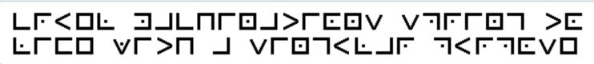
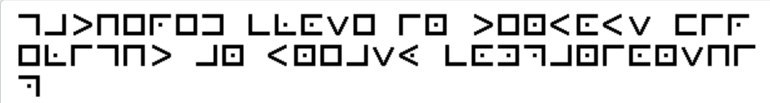
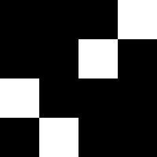

# Практические задания к уроку 27.09.2024
## Самая любимая категория
### Задание 1.
Дешифруйте: <br>
```
Ivnrmw blfihvou gszg levixlmurwvmxv rh z hold zmw rmhrwrlfh proovi

Zh oruv vyyh gviiryov erhgzh lu vnkgrmvhh ivevzo gsvnhvoevh

Gsv dzb rh org gsv kzgs rh xovzi dv ivjfriv lmob gsv hgivmtgs gl uloold rg

Hvrav gsrh nlnvmgfn kfhs lm gl gsv gzh'h vmw

Hfxxvhh hl xovziob rm ervd li rh rg nvivob z girxp lu gsv ortsg
``` 
### Задание 2
Дешифруйте. <br>
```
Or jnel, gevhzcunag cevqr cerpvcvgngrf n qvmmlvat snyy

Naq abj gur gehr grfg: ubyq snfg be rkcver

Cebqvtvbhf fvmr nybar qbrf abg qvffhnqr gur funecrarq oynqr

Znal snyy va gur snpr bs Punbf, ohg abg guvf bar, abg gbqnl

Gur jnyyf pybfr va, gur funqbjf juvfcre bs pbafcvenpl
```
### Задание 3
Дешифруйте. <br>





## Решетка Кардано
### Задание 1.
Решетка Кардано: <br>
 <br>
```|пгаиртирирф Кояг жуллв  анюоаарьенер чВйти оветоро ыМоо ийВн вй |```<br>
Внимание: вертикальные границы стоят для точного обозначения каждого символа, они не входят в шифртекст. Все пробелы важны.
### Задание 2.
Решетка Кардано: <br>
 <br>
```|брзоняраОтабра аклдн совт—иаа сеергокто иеог нооотовоуйстг твоср га  рммаипыилор ояпь тьслю цепниортпеабри онцг         ы       |``` <br>
Внимание: вертикальные границы стоят для точного обозначения каждого символа, они не входят в шифртекст. Все пробелы важны.

## Частотный анализ
### Задание 1.
Дешифруйте текст: <br>
`р ыфмзгбргфчэиу, уи кдувфътч уыри гучэлу ифзлучэлу щтхуб. гдуийчзц уыри, ыдйхум зучытг, р бфзэ втгтчэуи з лдрлую «йдт!» кувфътч бкфдфы р увухитч фху. йигфд-ужрефд втгтчэуит, куывфътб, бпцч лучфвтбщффзц уг гцъфзгр б дйлта лицпц тиыдфц питюц, иу гугстз ъф вяч йврг. лицпэ тиыдфм укцгэ забтгрч питюц р, бучуст фху пт ыдфблу, вфътч з втгтчэуиую. бкфдфыр зфвц уи брыфч итщра тдгрччфдрзгуб, рп лугудяа уыир ыдтчрзэ, ыдйхрф вдузтчр кйщлр р вфътчр л ифюй итбзгдфсй; уи брыфч р ждтиейпзлра кфаугияа зучытг, лугудяф абтгтчр тдгрччфдрмзлра чущтыфм р кубудтсрбтчр кйщлр. лицпэ тиыдфм з втгтчэуиую йъф вяч б ыбтыетгр щтхта уг удйырм. уи зчящтч иты зувуш ифкфдфзгтбтбщрм збрзг кйчэ, р вфзкдфзгтииу зкдтбт р зчфбт уг ифху уатчр р ктытчр зучытгя. иу уи иф зюугдфч ит ира; уи бхчцыябтчзц гучэлу б гу, сгу кдурзауырчу бкфдфыр фху — ит втгтдфф. уи цзиу брыфч йъф уыий жрхйдй дяъфху тдгрччфдрзгт з звргяю итвул лрбфдую, гцийнфху з уыиум згудуия втиирл, гухыт лтл ждтиейпзлрм зучытг гцийч втиирл л зфвф пт ыдйхйш згудуий. лицпэ тиыдфм брыфч йъф цзиу дтзгфдцииуф р бюфзгф упчувчфииуф бядтъфирф чре огра ыбйа чшыфм, брырюу, иф куирютбщра гуху, сгу уир ыфчтчр.
«сгу уир ыфчтшг? — ыйютч лицпэ тиыдфм, хчцыц ит ира. — птсфю иф вфърг дяърм тдгрччфдрзг, лухыт й ифху ифг удйърц? птсфю иф лучфг фху ждтиейп? иф йзкффг ыувфътгэ, лтл ждтиейп бзкуюирг у дйъэф р птлучфг фху».`

